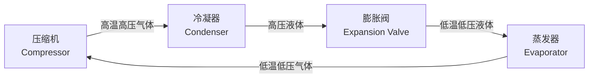
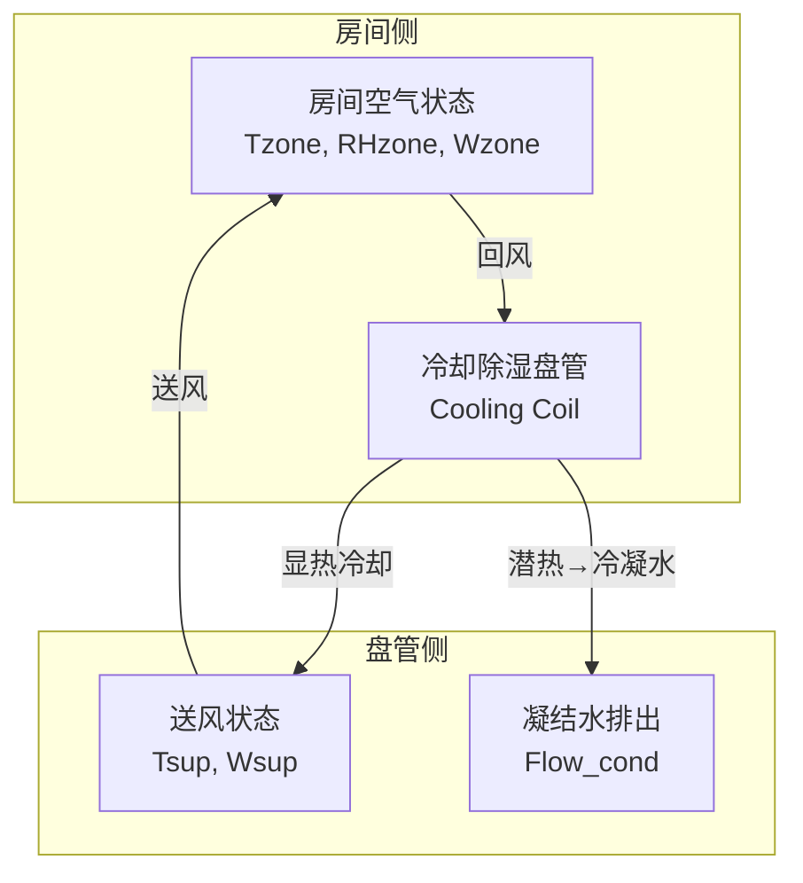
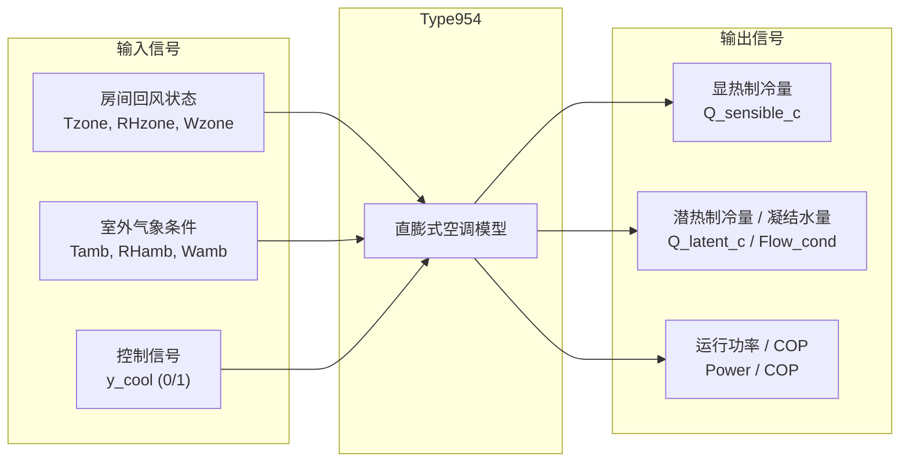
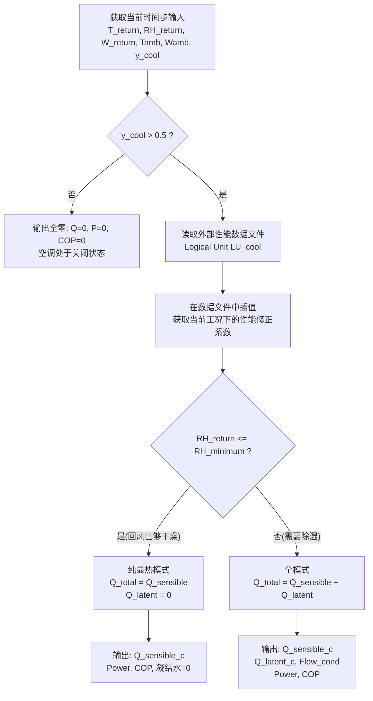
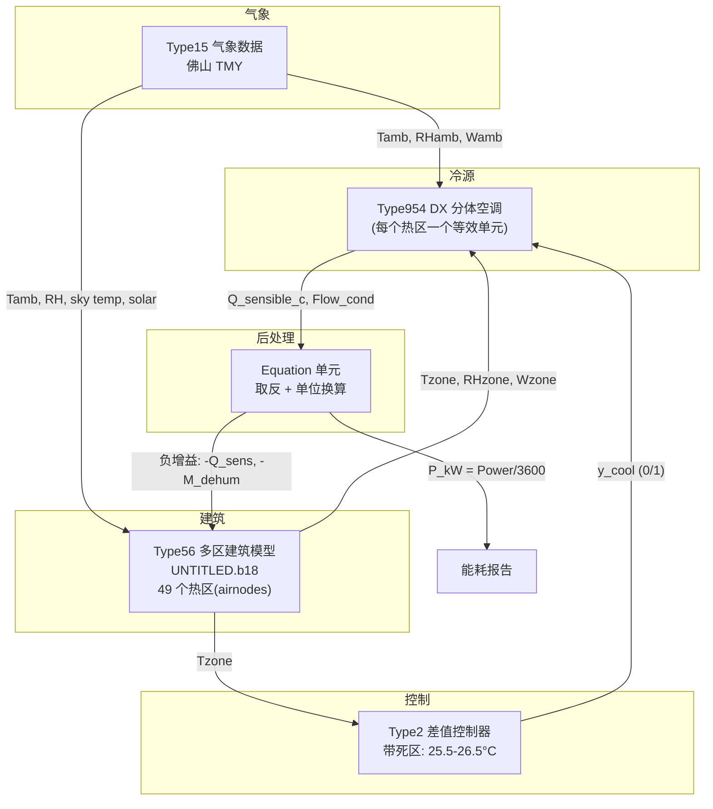
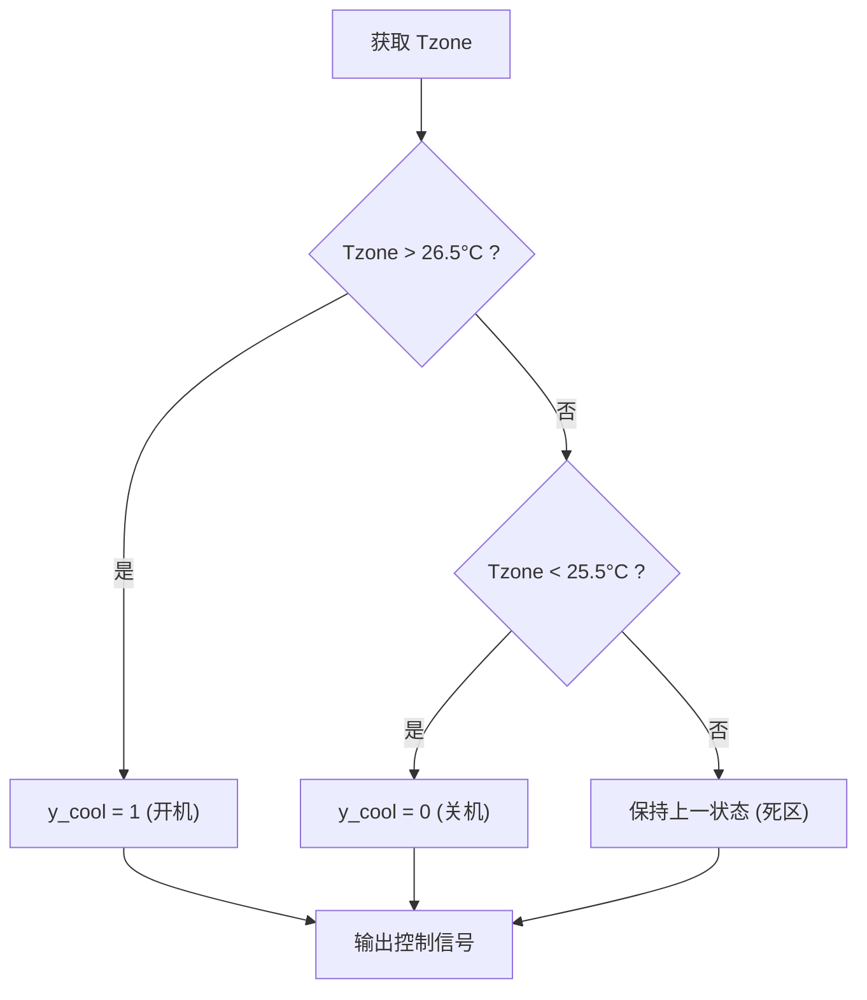

# 制冷机理与闭环节能分析

## 目录

1. [项目背景](#1-项目背景)
2. [制冷循环基础机理](#2-制冷循环基础机理)
3. [Type954 的角色与功能详解](#3-type954-的角色与功能详解)
4. [闭环节能系统架构](#4-闭环节能系统架构)
5. [物性与控制逻辑](#5-物性与控制逻辑)
6. [关键参数设置与物理意义](#6-关键参数设置与物理意义)
7. [常见误区与排错指南](#7-常见误区与排错指南)
8. [总结](#8-总结)

---

## 1. 项目背景

本项目基于 **TRNSYS 18** 平台，构建以直立式分体空调 (Direct Expansion, DX) 作为冷源的 **建筑热区闭环节能 (Closed-loop Energy Simulation)** 模型。

当前状态:

- **Type56** 多区建筑模型已完成佛山气象数据(CN_Foshan_hour.tm2)下的理想冷源(无限制冷量)计算，可输出各热区的 QCOOL(显冷)与 QLATD(潜冷)需求。
- Type954 直膨式空调模型准备接入，实现"房间温湿度 → DX 空调实际制冷 → 房间温湿度"的闭环。
- 49 个热区(airnodes)覆盖办公、会议、厕所、走廊四类功能区域，当前仅 4 个 airnode 通过理想冷源计算负荷。

核心目标:

- 实现 Type56 与 Type954 的闭环耦合，将"理想冷源的负荷输出"升级为"实际 DX 空调制冷下的室内温湿度响应"。

---

## 2. 制冷循环基础机理

### 2.1 蒸气压缩制冷循环 (Vapor Compression Cycle)

分体式 DX 空调(如本文使用的 Type954)基于经典的蒸气压缩制冷循环，核心四大部件构成闭合环路:

**四个步骤的微观热力学过程:**

| 步骤 | 部件 | 制冷剂状态变化 | 热力过程 | 关键物理量 |
|:---|:---|:---|:---|:---|
| 1→2 | 压缩机 | 低温低压气体→高温高压气体 | 近似等熵压缩 | $W_{comp}$ = 压缩机功耗 |
| 2→3 | 冷凝器 | 高温高压气体→高压液体 | 等压冷凝放热 | $Q_{cond}$ = 冷凝排热量 |
| 3→4 | 膨胀阀 | 高压液体→低温低压气液混合物 | 等焓节流 | $h_3 = h_4$ |
| 4→1 | 蒸发器 | 低温低压气液混合物→低温低压气体 | 等压蒸发吸热 | $Q_{evap}$ = 蒸发制冷量 |

### 2.2 室内侧空气处理过程 — Psychrometric 分析

分体空调室内机的空气处理过程在焓湿图(psychrometric chart)上表现如下:

Type954 内部使用 **Psychrometric mode** (Humidity mode = 2)，实际处理路径为:

1. 回风(return air)进入蒸发器盘管，与低温制冷剂换热。
2. 当盘管表面温度低于回风露点温度时，空气经历**冷却除湿**:温度下降的同时，水蒸气凝结析出。
3. 当回风含湿量已经很低(RH 低于用户设定阈值)时，模型自动切换为**纯显热冷却**：仅降温，不除湿。

**核心关系式**:

$$
\text{总制冷量} = \text{显热制冷量} + \text{潜热制冷量}
$$

$$
Q_{total} = Q_{sensible} + Q_{latent}
$$

其中:

- 显热制冷量 $Q_{sensible}$ :降低空气干球温度，表示为送回风温度差。
- 潜热制冷量 $Q_{latent}$ :冷凝水析出，驱动力为送回风含湿量差。

---

## 3. Type954 的角色与功能详解

### 3.1 Type954 是什么

Type954 是 TRNSYS TESS Library 中的 **直膨式分体空调 (Direct Expansion Split System)** 组件。它模拟一台完整的单速/多联机 DX 空调的性能行为。

**它的本质: 基于性能修正系数的查表模型，而不是简单的 COP 效率模型。**

用户在参数面板中填入的 `Rated_xxx` 参数仅仅是**基准缩放因子**。模型实际输出的制冷量和功率，是这些基准值乘以外部数据文件(Catalog data)中插值得到的修正系数。因此，**必须确保 `LU_cool` 指向的性能数据文件是准确的**(包含不同室外干球温度、室内干/湿球温度下的容量和功率修正系数)。

### 3.2 Type954 在系统架构中的核心角色

Type954 在整个闭环节能系统中扮演 **实际冷源模型 (Realistic Cooling Source)** 的角色:

它完成三项核心功能:

1. **冷量计算** — 不再依赖"理想冷源"(COOL001 中 POWER=999999999 的无限制冷量)，而是根据实际 DX 空调的额定容量、性能数据文件和实际运行工况，计算出真实的显热/潜热制冷量。
2. **能耗/COP 计算** — 同时给出压缩机和风机功耗，为后续全年运行能耗统计和碳排放分析提供基础。
3. **物理约束实施** — 引入真实的设备容量上限、SHR(显热比)约束、除湿触发逻辑，使模拟结果具有工程可解释性。

### 3.3 Type954 内部工作流程

### 3.4 关键输出信号速查(应聚焦的输出)

| 输出编号 | 物理量 | 符号 | 单位 | 用途 |
|:--|:--|:--|:--|:--|
| Output 7 | 显热制冷量 | $Q_{sensible,c}$ | kJ/h | 反馈至 Type56 的 Convective Gain |
| Output 8 | 潜热制冷量 | $Q_{latent,c}$ | kJ/h | (参考) |
| Output 13 | 总电功率 | $P_{total}$ | kJ/h | 能耗统计，除以 3600 得 kW |
| Output 14 | COP | COP | — | 运行效率参考 |
| Output 21 | 凝结水流量 | $\dot{m}_{cond}$ | kg/h | 反馈至 Type56 的 Humidity Gain |

---

## 4. 闭环节能系统架构

### 4.1 总体架构图

### 4.2 闭环信息流详解

闭环核心在于 **"房间状态 → DX 空调响应 → 反馈到房间 → 房间状态更新"** 的循环:

1. **Type56 输出房间热湿状态**: $T_{zone}$ (空气温度), $RH_{zone}$ (相对湿度), $W_{zone}$ (含湿量)，通过 NTypes 输出连接至 Type954。
2. **Type954 作为冷源响应**: 根据回风状态、室外气象条件、控制信号，计算该时间步内 DX 空调实际可提供的显热制冷量 $Q_{sensible,c}$ 和凝结水流量 $\dot{m}_{cond}$。
3. **Equation 取反反馈**: 制冷是从房间取走热量和水分，所以在增益输入中必须取负号:
   $$
   Q_{Gain} = -Q_{sensible,c} \quad \text{[kJ/h]}
   $$
   $$
   M_{Gain} = -\dot{m}_{cond} \quad \text{[kg/h]}
   $$
4. **Type56 接收负增益更新房间状态**: 通过 TRNBuild 中创建的 `GAIN_DX_xxx` (Convective=INPUT, Abs.Humidity=INPUT)，将上述反馈连入房间热湿平衡方程。

### 4.3 当前建模策略(阶段 2 → 阶段 N)

**当前**: 仅对代表性的一个办公热区 `S_bgs1` 做闭环测试。

**扩展路线**:

1. 按类型逐一打通: `S_bgs1` (办公) → `S_hys1` (会议) → `S_cs1` (厕所) → `S_zl1` (走廊)。
2. 同类热区采用 **等效代表法**: 一个代表热区的 DX 空调能耗乘以修正系数推出全楼同类能耗。
3. 论文中表述为 "Each thermal zone is served by an equivalent split-type DX air-conditioning unit." 避免"每个小房间一台壁挂机"的尺度失真。

---

## 5. 物性与控制逻辑

### 5.1 房间热湿平衡方程

在 TRNBuild 中，每个空气节点的瞬时热平衡为:

$$
\rho c_p V \frac{dT_{zone}}{dt} = Q_{internal} + Q_{solar} + Q_{transmission} + Q_{ventilation} + Q_{DX}
$$

其中 $Q_{DX}$ 为负值(制冷取热)，代表分体 DX 空调的显冷量反馈。

湿平衡类似:

$$
\rho V \frac{dW_{zone}}{dt} = \dot{m}_{people} + \dot{m}_{infiltration} + \dot{m}_{ventilation} + \dot{m}_{DX}
$$

其中 $\dot{m}_{DX}$ 为负值，代表凝结除湿量。

### 5.2 温度控制死区逻辑

为避免空调频繁启停(Model oscillation)，采用带死区的开关控制:

死区 25.5°C ~ 26.5°C 提供了 1°C 的滞环，避免在设定点附近频繁跳变。

### 5.3 除湿控制逻辑(Type954 内部)

Type954 的除湿触发与停止由参数 `Minimum %RH for latent heat transfer` 控制:

- 当回风 $RH_{return} > RH_{min}$ 时，除湿功能启用，蒸发器进行冷却除湿(总制冷量 = 显冷 + 潜冷)。
- 当回风 $RH_{return} \le RH_{min}$ 时，除湿功能关闭，模型锁定 $Q_{total} = Q_{sensible}$，即进入纯显热冷却模式，出口含湿量等于入口含湿量。

**工程建议**: 将 $RH_{min}$ 设为 50%~55%，而不是目标 60%。这为相对湿度在 55%~65% 之间自然波动提供合理的控制死区，避免临界振荡。

---

## 6. 关键参数设置与物理意义

### 6.1 Type954 额定参数设置清单

以下数值基于 130 kW 峰值负荷、COP=3.2、SHR=0.75 的科学推导:

| 参数名称 | 建议值 | 单位 | 物理意义 |
|:---|:---|:---|:---|
| Humidity mode | 2 | — | 标准 Psychrometric 模式 |
| LU_cool | 11 | — | 外部性能数据文件的逻辑单元号 |
| LU_heat | 12 | — | 外部性能数据文件的逻辑单元号 |
| Total air flow rate | 9300 | L/s | 匹配冷量的合理风量($\Delta T \approx 10°C$) |
| Rated air flow rate | 9300 | L/s | 与 Total air flow rate 一致 |
| Rated indoor fan power | 16500 | kJ/h | 约 4.6 kW |
| Rated outdoor fan power | 8300 | kJ/h | 约 2.3 kW |
| Rated total cooling capacity | 540000 | kJ/h | 150 kW (含 1.15 倍安全系数) |
| Rated sensible cooling capacity | 405000 | kJ/h | 112.5 kW (SHR = 0.75) |
| Rated cooling power | 168750 | kJ/h | 46.8 kW (COP = 3.2) |
| Minimum %RH for latent heat transfer | 55 | % | 除湿死区下限，防振荡 |
| Auxiliary heat mode | 0 | — | 纯制冷，不启用辅热 |

### 6.2 单位陷阱警示

| 陷阱 | 正确做法 |
|:---|:---|
| Type954 容量参数单位是 **kJ/h**，不是 kW | $P[kW] \times 3600 = P[kJ/h]$ |
| 风量单位是 **L/s**，不是 m³/h | 1 m³/s = 1000 L/s |
| 增益反馈到 Type56 时，TRNBuild 的 Gain/loss 界面如果是 kJ/h，则直接取负 | $Q_{Gain} = -Q_{sensible,c}$ |
| Gain/loss 如果以 W 为单位，则需除以 3.6 | $Q_{Gain}[W] = -Q_{sensible,c}[kJ/h] / 3.6$ |

### 6.3 SHR(显热比)的调参策略

| 场景 | SHR 建议值 | 说明 |
|:---|:---|:---|
| 普通办公/商业 | 0.75 ~ 0.80 | 人员密度适中 |
| 人员密集(会议室/餐厅) | 0.65 ~ 0.70 | 潜热负荷比例高 |
| 计算机房/数据中心 | 0.85 ~ 0.95 | 几乎全显热 |

调参依据:如果仿真中 RH 长期偏高 → 潜热能力不足 → 降低 SHR;如果 RH 被拉得过低 → 除湿过强 → 提高 SHR。

---

## 7. 常见误区与排错指南

### 7.1 闭环连接拓扑错误

**错误**: 将 Type56 的 QCOOL 输出连至 Type954 作为"目标冷量"。

**正确**: 将 Type56 的 Tzone / RHzone / Wzone 连至 Type954 作为"回风状态输入"，再将 Type954 的实际制冷量反馈给 Type56。

### 7.2 增益符号错误

| 检查点 | 正确极性 |
|:---|:---|
| Convective gain 输入 | **必须为负值**(制冷取热) |
| Abs. Humidity gain 输入 | **必须为负值**(除湿取水) |

### 7.3 重复制冷问题

如果在 Type56 中保留了 `COOLING=COOL001` 这样的理想冷源，同时又把 Type954 的负增益接进来，则会出现"理想冷源 + DX 空调"的双重制冷。关闭闭环测试热区的 COOLING type(改用 `GAIN_DX_xxx`)。

### 7.4 时间步长选择

| 场景 | 建议 STEP | 说明 |
|:---|:---|:---|
| 负荷计算(理想冷源) | 1 h | 稳态，可接受 |
| DX 闭环仿真 | 0.25 h (15 min) | 开关控制需要更细粒度 |
| 精细振荡分析 | 0.1 h (6 min) | 研究控制品质时用 |

### 7.5 TRNBuild Gain/loss 类别

选择 **miscellaneous** 而非 people/lights/equipment。应选 **absolute gain/loss** 而非 "related to reference floor area"，否则制冷量会被面积放大几百倍。

---

## 8. 总结

### 8.1 Type954 的角色一句话概括

**Type954 是直膨式分体空调的物理性能模型，在闭环节能仿真中担任"实际冷源"角色:接收房间热湿状态和室外气象条件，基于设备额定参数和性能修正系数计算出该时间步内真实可提供的制冷量、除湿量和运行功耗，并通过负增益反馈至建筑模型，形成"房间温度变→DX 空调制冷→房间温度变"的闭合物理回路。**

### 8.2 制冷过程一句话概括

**基于蒸气压缩制冷循环，压缩机驱动制冷剂在蒸发器中低温蒸发吸热，带走室内空气的显热和潜热(冷凝水);冷凝器将热量排至室外。Type954 通过 Psychrometric 模式模拟室内空气侧的冷却除湿过程，并在回风已足够干燥时自动切换为纯显热冷却。**

### 8.3 项目推进检查表

1. [ ] 备份当前 Type56 模型为 `Type56_DX_closed_loop_test.b18`
2. [ ] 仅对 `S_bgs1` 做闭环测试，其他热区先不动
3. [ ] 为 `S_bgs1` 增加 TAIR/RELHUM/含湿量 输出
4. [ ] 取消 `S_bgs1` 的 COOL001 理想冷源
5. [ ] 在 TRNBuild 新建 `GAIN_DX_S_bgs1` (Convective=INPUT, Abs.Humidity=INPUT)
6. [ ] 在 Studio 放置 DX_S_bgs1 (Type954) 并填写额定参数
7. [ ] 连接 Tzone/RHzone/Wzone → Type954，以及 Type15 室外侧 → Type954
8. [ ] 用 Type2 做温控器 (26.5°C 开 / 25.5°C 关)
9. [ ] Equation 取反 Type954 的 Q_sensible_c 和 Flow_cond，接回 Type56
10. [ ] STEP 改为 0.25 h
11. [ ] 先只接显热，跑通温度闭环后再接湿度闭环
12. [ ] 运行 1~2 周测试，检查 Tzone/RHzone/y_cool/P/COP

---

*本文件基于 TRNSYS 18 + TESS Library Type954 的工程实践编写，参数推导依托项目现有仿真文件(Untitled.b18、Untitled.dck、SUMMARY.BAL)和佛山 TMY2 气象数据。*
