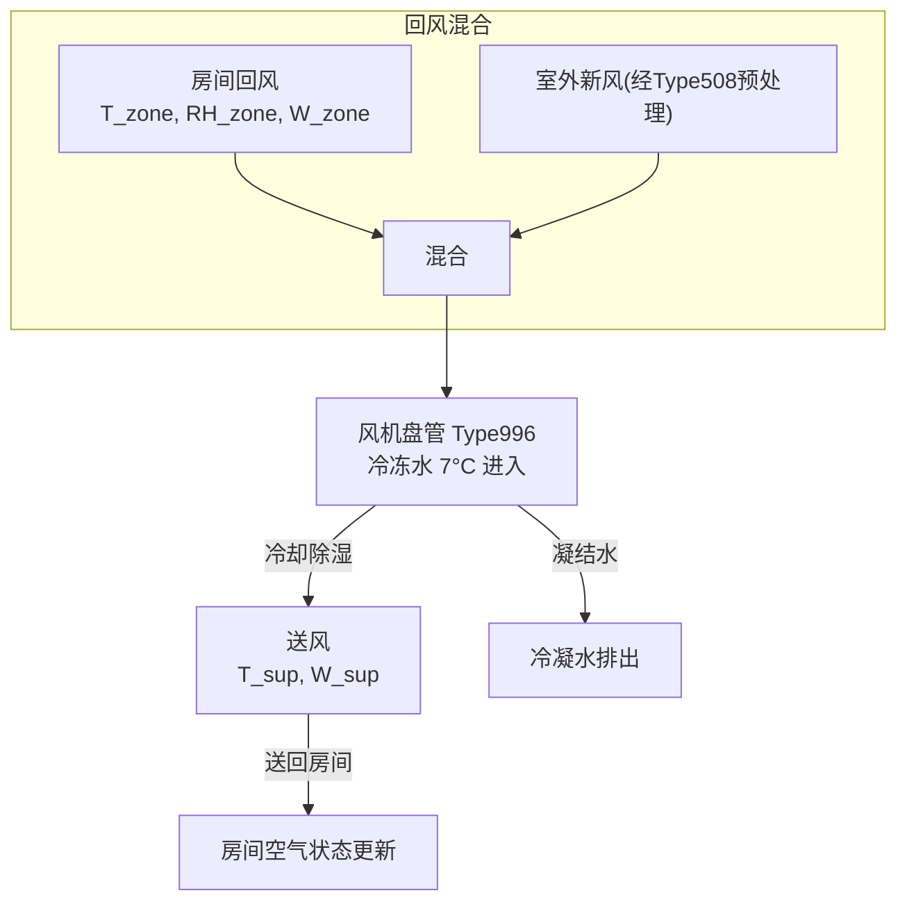
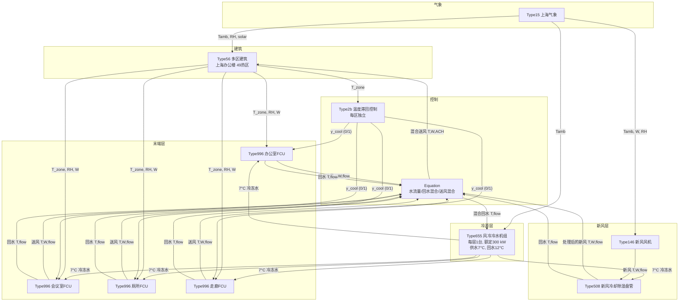
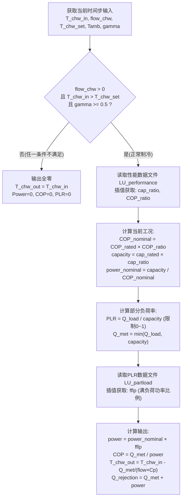
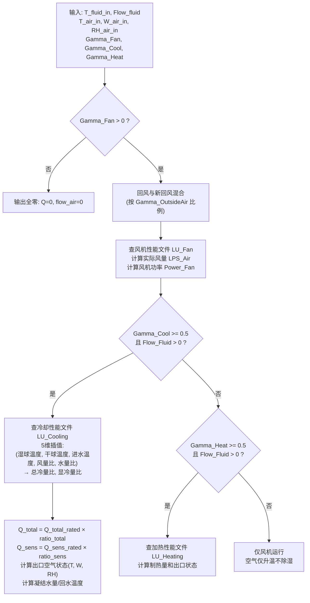
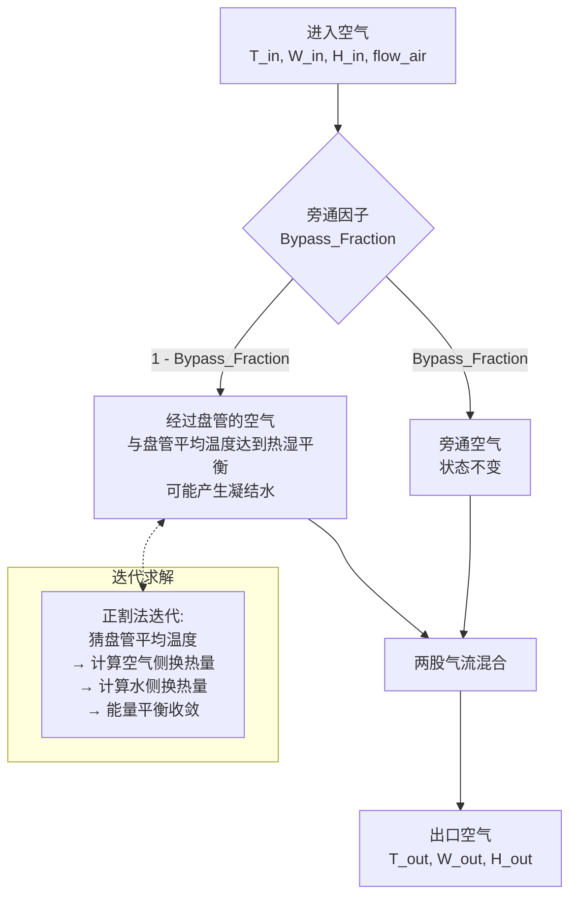
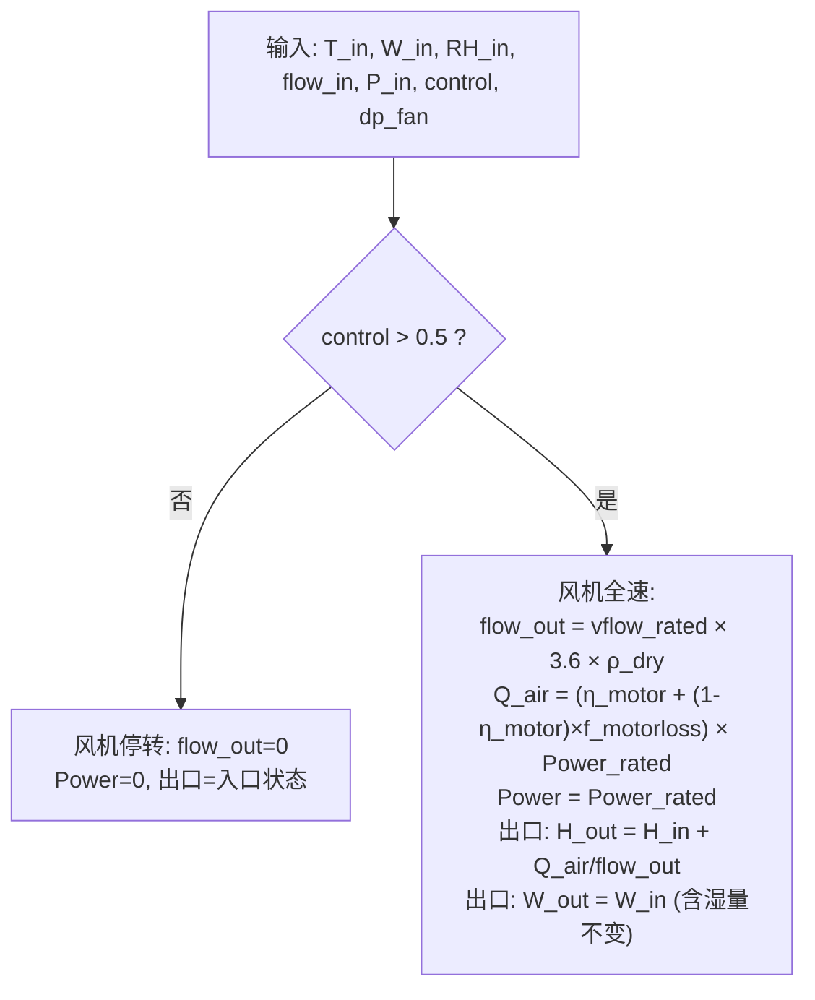

# 中央空调制冷机理与冷源模块功能分析

## 目录

1. [项目背景](#1-项目背景)
2. [风冷冷水循环制冷机理](#2-风冷冷水循环制冷机理)
3. [系统总体架构与冷量流](#3-系统总体架构与冷量流)
4. [冷源相关模块功能详解](#4-冷源相关模块功能详解)
   - 4.1 [Type655 — 风冷冷水机组 (冷源核心)](#41-type655--风冷冷水机组-冷源核心)
   - 4.2 [Type996 — 二管制风机盘管 (冷量交付终端)](#42-type996--二管制风机盘管-冷量交付终端)
   - 4.3 [Type508 — 旁通因子冷却盘管 (新风除湿/降温)](#43-type508--旁通因子冷却盘管-新风除湿降温)
   - 4.4 [Type146 — 单速风机 (新风引入)](#44-type146--单速风机-新风引入)
5. [各模块在系统中的角色分工](#5-各模块在系统中的角色分工)
6. [关键控制逻辑与参数速查](#6-关键控制逻辑与参数速查)
7. [总结](#7-总结)

---

## 1. 项目背景

本项目基于 **TRNSYS 18** 平台，为上海商用办公楼（南北两栋各 6 层，总空调面积约 19,190.8 m²）构建**风冷冷水中央空调闭环节能仿真模型**。

**系统方案：风冷冷水机组 + 冷冻水循环 + 风机盘管末端 + 独立新风除湿。**

- 冷源：每层 1 台等效 Type655 风冷冷水机组（初期仿真），全楼共 12 台
- 末端：每层 4 台 Type996 风机盘管（办公、会议、厕所、走廊）
- 新风：每层 1 台 Type146 新风风机 + 1 台 Type508 冷却除湿盘管
- 建筑：Type56 多区建筑模型，使用上海气象数据 `CN-Shanghai-583670.tm2`

---

## 2. 风冷冷水循环制冷机理

### 2.1 二次换热结构

风冷冷水中央空调采用 **二次换热** 架构，将制冷循环分为两个相互隔离的回路：

```mermaid
flowchart LR
    subgraph 一次回路(制冷剂侧)
    A["压缩机"] -->|"高温高压气体"| B["风冷冷凝器"]
    B -->|"高压液体"| C["膨胀阀"]
    C -->|"低温低压液体"| D["蒸发器(壳管式)"]
    D -->|"低温低压气体"| A
    end
    subgraph 二次回路(冷冻水侧)
    D -.-|"换热"| E["冷冻水循环"]
    E --> F["风机盘管(FCU)"]
    F -->|"吸热后升温"| E
    end
    F -.-|"冷却除湿"| G["房间空气"]
    G -.-|"回风"| F
```

### 2.2 各环节热力过程

| 环节 | 位置 | 介质 | 热力过程 | 关键物理量 |
|:---|:---|:---|:---|:---|
| 压缩 | 压缩机 | 制冷剂蒸气 | 低温低压→高温高压 | $W_{comp}$ 压缩机功耗 |
| 冷凝 | 风冷冷凝器 | 制冷剂→室外空气 | 等压冷凝放热 | $Q_{rej}$ = 冷凝排热量 |
| 节流 | 膨胀阀 | 制冷剂液体 | 等焓节流降压 | $h_3 = h_4$ |
| 蒸发 | 壳管蒸发器 | 制冷剂←冷冻水 | 等压蒸发吸热 | $Q_{chw}$ = 冷冻水制冷量 |
| 输送 | 冷冻水管网 | 冷冻水 7→12°C | 显热输送 | $\dot{m}c_p\Delta T$ |
| 末端换热 | 风机盘管 | 冷冻水→室内空气 | 显热＋潜热交换 | $Q_{total} = Q_{sens} + Q_{lat}$ |

### 2.3 室内空气侧 Psychrometric 过程



核心转换关系：
$$
Q_{total,c} = \dot{m}_{dryair} \times (h_{in} - h_{out})
$$
$$
Q_{sens,c} = \dot{m}_{dryair} \times c_p \times (T_{in} - T_{out})
$$
$$
Q_{lat,c} = Q_{total,c} - Q_{sens,c} = \dot{m}_{cond} \times h_{fg}
$$

---

## 3. 系统总体架构与冷量流



---

## 4. 冷源相关模块功能详解

### 4.1 Type655 — 风冷冷水机组 (冷源核心)

**全限定名：** `Type655` — Air-Cooled Chiller (TESS Library)

**角色：整个中央空调系统的核心冷源。** 它通过蒸气压缩循环将冷冻水从 12°C 降至 7°C，再将热量排至室外空气。是系统中唯一的主动制冷设备。

#### 4.1.1 内部工作逻辑

Type655 不是简单的 COP 模型，而是**基于外部查表数据的性能模型**：



#### 4.1.2 关键参数

| 参数 | 建议值 | 单位 | 说明 |
|:---|:---|:---|:---|
| Rated Capacity | 1,080,000 | kJ/h (300 kW) | 每层等效冷水机组额定冷量 |
| Rated COP | 3.2 | — | 额定工况能效比 |
| LU_performance | 11+ | — | 容量/COP 性能数据文件逻辑单元号 |
| LU_partload | 12+ | — | PLR-Fraction Full Load Power 数据文件 |
| Cp_Fluid | 4.19 | kJ/(kg·K) | 冷冻水比热 |
| N_ambients | ≥2 | — | 性能数据中的环境温度点数 |
| N_chw | ≥2 | — | 性能数据中的冷冻水设定温度点数 |
| N_plr | ≥2 | — | PLR 数据中的部分负荷率点数 |

#### 4.1.3 关键输入/输出

| I/O | 变量 | 说明 |
|:---|:---|:---|
| Input 1 | T_chw_in | 冷冻水回水温度(来自末端回水混合) |
| Input 2 | flow_chw | 冷冻水流量 (m_chiller) |
| Input 3 | T_chw_set | 冷冻水出水设定温度 (7°C) |
| Input 4 | T_ambient | 室外干球温度 (来自 Type15) |
| Input 5 | gamma | 冷水机组启停控制信号 (Chiller_on) |
| **Output 1** | **T_chw_out** | **冷冻水出水温度 → 供末端和新风盘管** |
| Output 3 | Power | 冷水机组电功率 (kJ/h ÷3600→kW) |
| Output 5 | COP | 运行能效比 |
| Output 7 | Q_met | 实际制冷量 |
| Output 8 | PLR | 部分负荷率 |

#### 4.1.4 模块亮点与技术要点

- **双重查表建模**：性能数据文件决定容量和 COP 随工况的变化规律，PLR 文件决定部分负荷下的功耗特性——更接近真实设备。
- **不制冷的三个条件**：水流量≤0、回水已低于设定温度、控制信号<0.5——任一满足立即停机。
- **排热量自动计算**：`Q_rejection = Q_met + Power`，满足热力学第一定律。

---

### 4.2 Type996 — 二管制风机盘管 (冷量交付终端)

**全限定名：** `Type996` — 2-Pipe Fan Coil Unit (TESS Library)

**角色：将冷冻水的冷量传递给室内空气的末端设备。** 每个功能区域(办公/会议/厕所/走廊)各配置一台。

#### 4.2.1 内部工作逻辑

Type996 是一个**基于多维性能图谱的终端模型**，其性能由外部 5 维数据文件确定：



#### 4.2.2 关键参数

| 参数 | 办公值 | 会议值 | 厕所值 | 走廊值 | 单位 |
|:---|:---|:---|:---|:---|:---|
| Rated Air Flow | 8167 | 4056 | 1944 | 3389 | L/s |
| Rated Liquid Flow | 25260 | 12544 | 6014 | 10482 | kg/h |
| Rated Total Cooling | 529200 | 262800 | 126000 | 219600 | kJ/h |
| Rated Sensible Cooling | 396900 | 197100 | 94500 | 164700 | kJ/h |
| Rated Fan Power | 10200 | 5100 | 2440 | 4250 | kJ/h |

#### 4.2.3 关键输入/输出

| I/O | 变量 | 说明 |
|:---|:---|:---|
| Input 1 | T_Fluid_In | 冷冻水进水温度 (来自 Type655 Output 1) |
| Input 2 | Flow_Fluid | 冷冻水流量 (来自 Equation 水阀控制) |
| Input 3-5 | T/W/RH_Air_In | 回风温湿度 (来自 Type56 对应热区) |
| Input 13 | Gamma_Cool | 制冷控制信号 (需 ≥ 0.5) |
| Input 14 | Gamma_Fan | 风机控制信号 (需 > 0) |
| Input 15 | Gamma_OutsideAir | 新风混合比 (通常 0，新风独立处理) |
| **Output 3** | **T_Air_Out** | **送风温度** |
| **Output 4** | **W_Air_Out** | **送风含湿量** |
| Output 6 | Mdot_DryAir | 干空气质量流量 (用于 ACH 换算) |
| Output 8 | Q_TotalCool | 总制冷量 |
| Output 9 | Q_SensCool | 显热制冷量 |
| Output 11 | Power_Fan | 风机功率 |
| Output 15 | Flow_Condensate | 凝结水流量 |

#### 4.2.4 模块亮点与技术要点

- **5 维性能插值**：能捕捉湿球/干球/水温/风量/水量五个自变量的交叉影响——比简单 SHR 模型精确得多。
- **额定工况一致性要求**：数据文件中 sens=1 且 total=1 的数据点必须对应用户填写的 Rated 参数——否则缩放基准错位。
- **Gamma_Cool 阈值**：源码中 `Gamma_Cool >= 0.5` 才进入制冷逻辑，不能用模糊的 0.2-0.3 信号。
- **风机独立建模**：通过 LU_Fan 性能文件，风量与风机功率之间的关系可真实模拟变风量运行。

---

### 4.3 Type508 — 旁通因子冷却盘管 (新风除湿/降温)

**全限定名：** `Type508` — Bypass Fraction Cooling Coil (TESS Library)

**角色：对新风进行预处理——夏季冷却除湿、控制送风含湿量。** 使用旁通因子法模拟盘管性能。

#### 4.3.1 内部工作逻辑 (旁通因子法)

Type508 的核心物理假设：一部分空气(旁通部分)不经过盘管，其余空气与盘管达到热湿平衡，两股气流再混合：



#### 4.3.2 控制模式

| Mode_Control | 控制目标 | 第 10 输入含义 | 适用场景 |
|:---|:---|:---|:---|
| 0 | 自由浮动 (free-floating) | 无第 10 输入 | 初期调试、系统跑通 |
| **1** | **控制出口干球温度** | T_Air_Want (°C) | 简单新风降温 |
| **2** | **控制出口含湿量** | W_Air_Want (kg/kg) | **上海夏季除湿首选** |
| 3 | 控制出口水温 | T_Fluid_Want (°C) | 特殊水侧控制 |

#### 4.3.3 关键输入/输出

| I/O | 变量 | 说明 |
|:---|:---|:---|
| Input 1 | T_Fluid_In | 冷冻水进水温度 (来自 Type655) |
| Input 2 | Flow_Fluid | 冷冻水流量 (m_oa) |
| Input 3-5 | T/W/RH_Air_In | 新风入口状态 (来自 Type146 出口) |
| Input 6 | Flow_Air | 空气质量流量 (来自 Type146 Output 4) |
| Input 9 | Bypass_Fraction | 旁通因子 (0.05-0.15) |
| Input 10 | 控制目标 | 含湿量 W_Air_Want (Mode_Control=2 时) |
| **Output 3** | **T_Air_Out** | 处理后新风温度 |
| **Output 4** | **W_Air_Out** | 处理后新风含湿量 |
| Output 8 | Q_Total | 盘管总换热量 |
| Output 11 | Flow_Condensate | 凝结水量 |
| Output 17 | Iters_Tot | 内部迭代总次数 (收敛诊断) |

#### 4.3.4 模块亮点与技术要点

- **正割法迭代**：内部通过双循环(盘管能量平衡 + 控制目标)的割线法求解盘管平均温度，不依赖固定热交换效率。
- **物理真实的旁通模型**：引入 Bypass_Fraction 参数表示空气未接触盘管的比例，符合真实盘管中翅片间隙导致的空气旁通现象。
- **含湿量控制**：Mode_Control=2 时以出口含湿量为目标，是上海高湿夏季新风除湿的首选模式。建议设定 `W_Air_Want = 0.0095 kg/kg`。

---

### 4.4 Type146 — 单速风机 (新风引入)

**全限定名：** `Type146` — Single Speed Fan (TESS Library)

**角色：将室外新风引入系统。** 是最简单的开关控制风机模型。控制信号 > 0.5 时全速运转，将风机电机热损失部分加入气流。

#### 4.4.1 内部工作逻辑



#### 4.4.2 关键参数

| 参数 | 建议值 | 单位 | 说明 |
|:---|:---|:---|:---|
| Humidity Mode | 2 | — | Psychrometric 模式 |
| Rated Volumetric Flowrate | 1200 | L/s | 每层新风量 |
| Rated Power | 4000-7400 | kJ/h | 风机额定功率 |
| Motor Efficiency | 0.8 | — | 电机效率 |
| Motor Heat Loss Fraction | 0.8 | — | 电机热损失进入气流的比例 |

#### 4.4.3 关键输入/输出

| I/O | 变量 | 说明 |
|:---|:---|:---|
| Input 1-3 | T/W/RH_in | 室外新风状态 (来自 Type15) |
| Input 4 | flow_in | 入口流量 (可设为 0 或上游来流) |
| Input 6 | control | 启停控制 (工作日 schedule) |
| **Output 1** | **T_out** | 风机出口温度 (含电机热, →Type508) |
| **Output 2** | **W_out** | 风机出口含湿量 (=入口含湿量) |
| Output 4 | flow_out | 出口质量流量 (→Type508 Input 6) |
| Output 6 | Power | 风机功率 |

#### 4.4.4 模块亮点与技术要点

- **电机热回收**：风机电机热量的 `Motor Heat Loss Fraction` 比例直接加入气流，提升出口温度——这对新风系统是真实的加分项。
- **含湿量不变**：风机不改变空气含湿量，仅因电机热升焓——新风除湿完全由下游 Type508 盘管承担。
- **质量平衡诊断**：源码中设置了 mass balance 检查，当输入和输出的质量流量不一致时累计失败次数并在最后 call 时汇总报警。

---

## 5. 各模块在系统中的角色分工

| 模块 | 在冷量链中的位置 | 核心功能 | 输入信号来源 | 输出信号去向 |
|:---|:---|:---|:---|:---|
| **Type655** | **冷源** (上游) | 生产 7°C 冷冻水 | 末端回水混合温度、水流量、启停信号、室外气温 | 冷冻水供所有 Type996 + Type508 |
| **Type996** | **末端** (中游) | 将冷冻水冷量转为冷风 | Type56 房间回风状态、Type655 出水温度、控制信号 | 送风温湿度→Type56; 回水→混合回 Type655 |
| **Type508** | **新风处理** (中游) | 新风冷却除湿 | Type146 出口新风状态、Type655 出水温度 | 处理后新风→与 FCU 送风混合→Type56 |
| **Type146** | **新风引入** (最上游) | 将室外空气送入系统 | Type15 室外气象、工作日 schedule | 升温(含湿量不变)后的新风→Type508 |
| **Type56** | **建筑** (下游) | 热湿响应 | 混合送风 T/W/ACH、气象、内部 gains | 输出各热区 T/RH/W→Type996 |

---

## 6. 关键控制逻辑与参数速查

### 6.1 冷量流控制方程式

```text
(1) 各区启停(Equation 调试版):
    cool_bgs = work_sch × GT(T_bgs, 26.5)

(2) 各末端水流量:
    m_bgs = 25260 × cool_bgs

(3) 冷水机组总负荷流量:
    m_load = m_bgs + m_hys + m_cs + m_zl + m_oa

(4) 最小流量保护:
    m_min = 0.3 × 51600
    m_chiller = Chiller_on × max(m_load, m_min)
    m_bypass = max(0, m_chiller - m_load)

(5) 冷水机组启停:
    Chiller_on = max(cool_bgs, cool_hys, cool_cs, cool_zl, work_sch)

(6) 回水混合温度:
    T_return = Σ(m_i × T_fluid_out_i) / max(0.01, m_load)

(7) 送风混合(以办公区为例):
    T_sup = (m_fcu × T_fcu_out + m_oa_office × T_oa_out) / max(0.01, total_air)
    ACH = total_air / (1.2 × V_zone)
```

### 6.2 单位转换速查

| 转换 | 公式 |
|:---|:---|
| kW → kJ/h | × 3600 |
| kJ/h → kW | ÷ 3600 |
| L/s → kg/h (干空气) | × 3.6 × ρ_dry (≈1.2) |
| kg/h → ACH | ÷ (1.2 × V_zone_m³) |

### 6.3 收敛与稳定性建议

| 措施 | 说明 |
|:---|:---|
| STEP 0.25 h | 闭环控制需要 15 min 以下步长 |
| 先跑水系统空载 | 只搭 Type655→假负载→回水→Type655 闭路 |
| 再逐一接入末端 | 先办公室→会议室→厕所/走廊 |
| Type508 先 free-floating | Mode_Control=0 跑通再切到 Mode_Control=2 |
| 回水混合分母用 m_load | 不用 Type655 Output 2 (避免代数环) |
| 供回水温差监控 | 末端回水应在 10-14°C，供水 7-9°C |

---

## 7. 总结

### 7.1 各模块角色一句话

| 模块 | 一句话角色 |
|:---|:---|
| **Type655** | 冷量源头——通过蒸气压缩制冷循环和外部查表数据，将冷冻水从 12°C 降至 7°C 并排热至室外 |
| **Type996** | 冷量交付——将冷冻水的冷量通过 5 维性能查表精准转换为送风冷量和凝结除湿量 |
| **Type508** | 新风卫士——用旁通因子法物理真实地模拟新风冷却除湿过程，可通过含湿量控制保证室内湿度 |
| **Type146** | 新风引入——简单可靠的开关风机，将室外空气送入系统并计入电机热增益 |

### 7.2 制冷全流程一句话

**室外空气 → Type146 新风风机(升温) → Type508 冷却除湿盘管(冷冻水冷却+含湿量控制) → 与 Type996 风机盘管送风混合 → Type56 建筑热区 → 房间回风 → Type996 风机盘管(冷冻水冷却除湿) → 各末端回水混合 → Type655 风冷冷水机组(压缩制冷重降至 7°C) → 循环。**

---

*本文件基于 TRNSYS 18 + TESS Library Type655/996/508/146 源码和项目现有仿真文件编写。*
